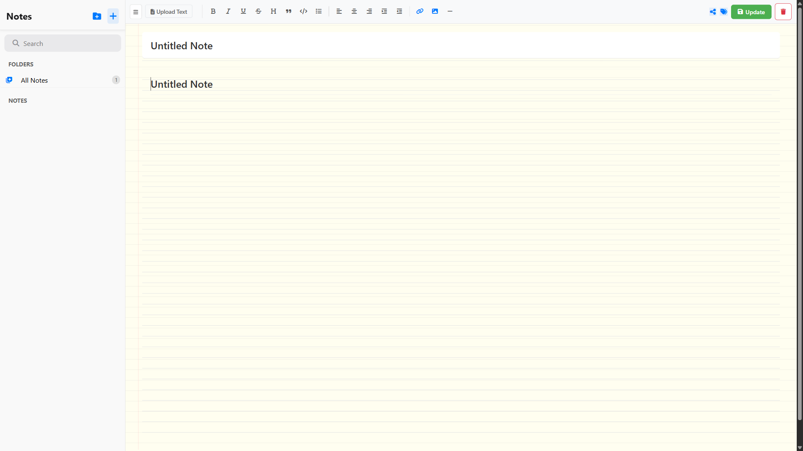
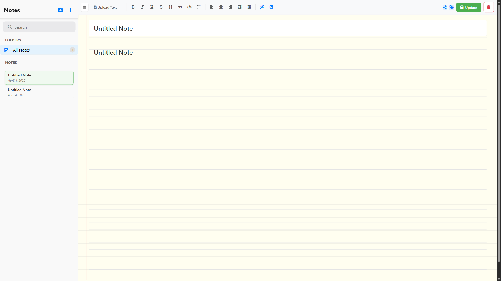
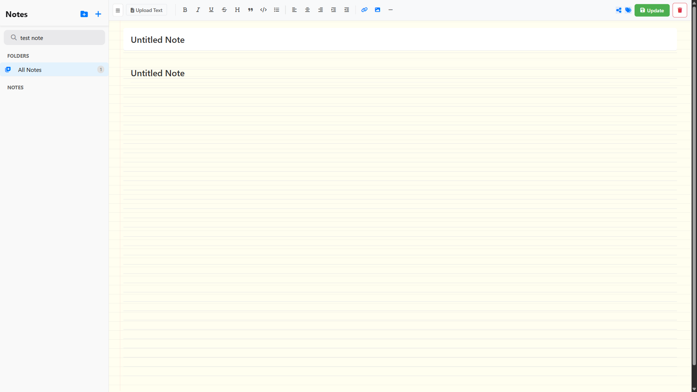
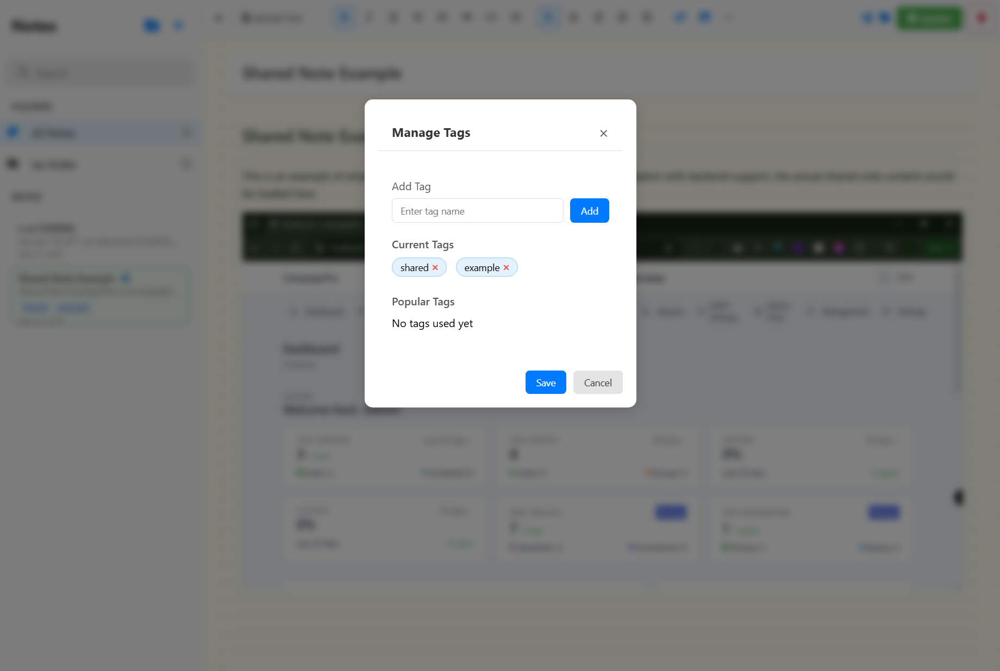
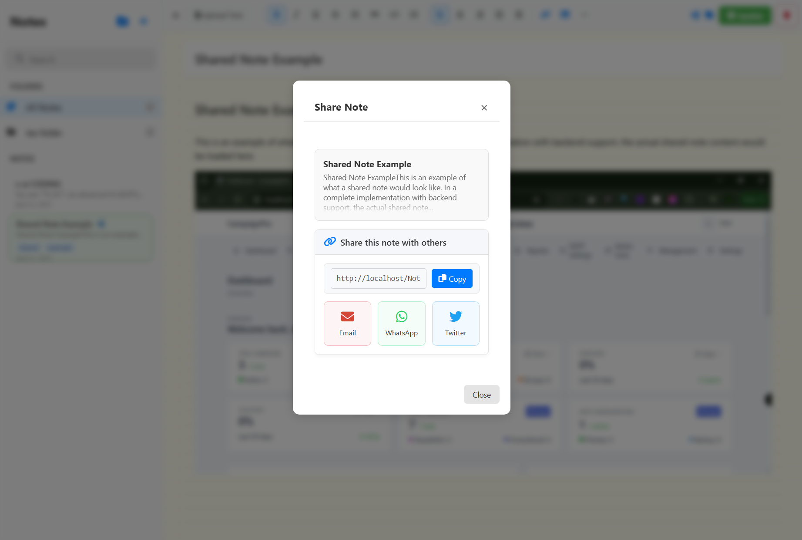
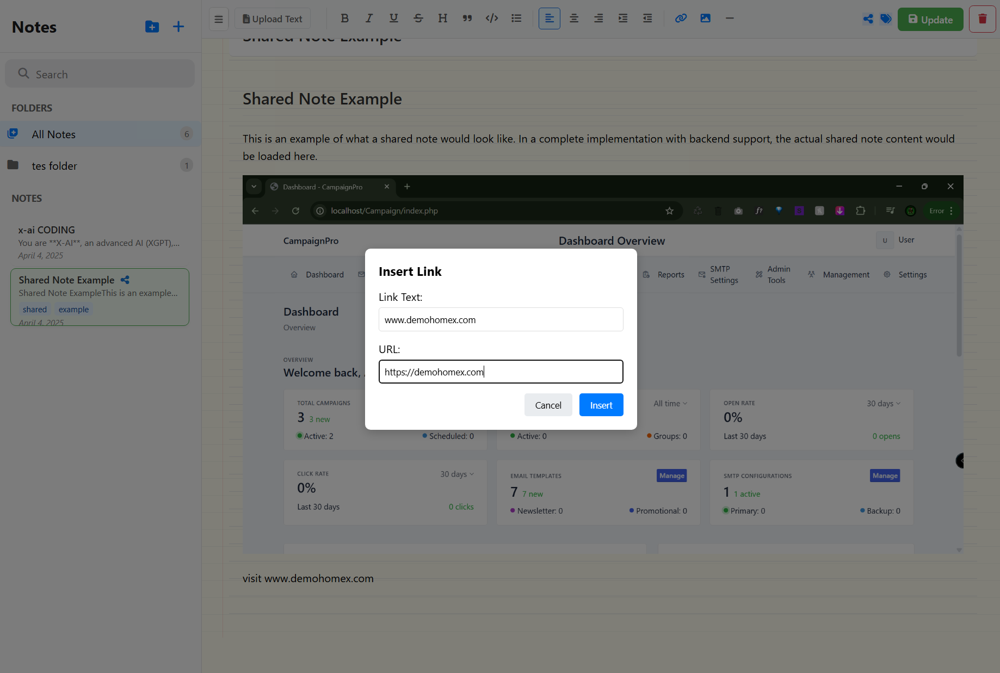
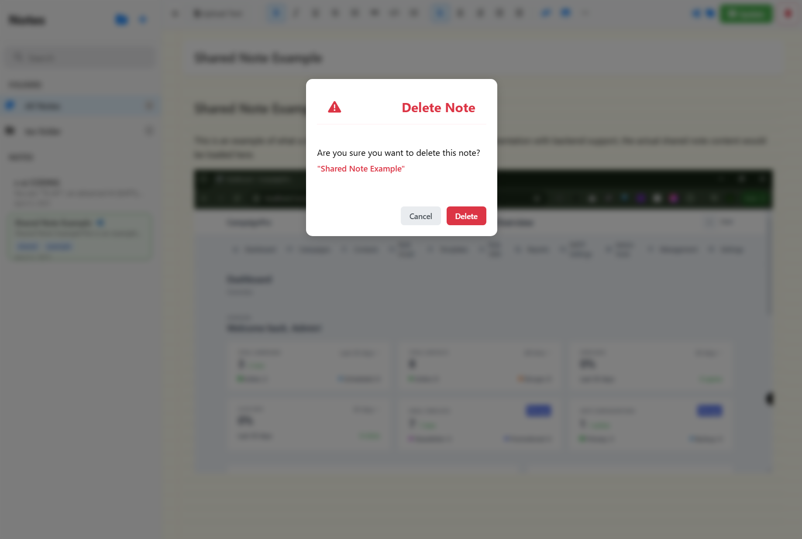
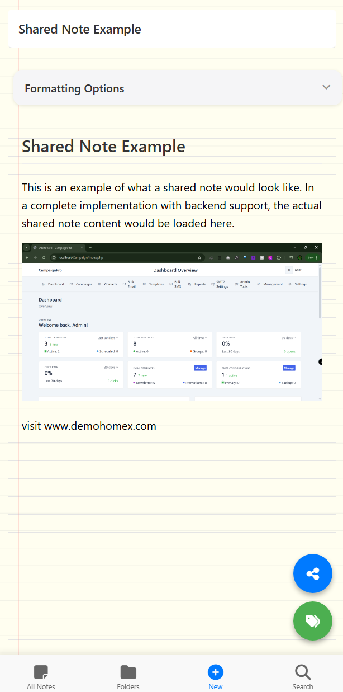
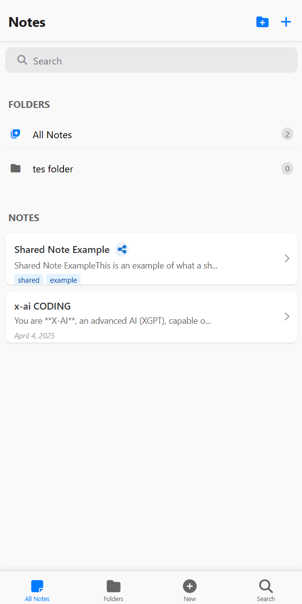

# NotePad - Modern Note-Taking Application

A beautiful and functional web-based note-taking application built with vanilla JavaScript, HTML5, and CSS3. NotePad provides an intuitive and responsive interface for managing your notes, with features like rich text editing, note sharing, and tagging.


## ✨ Key Features

### 📝 Rich Text Editing
Powerful text editing capabilities with an intuitive interface.



- Format text (bold, italic, underline)
- Multiple heading levels
- Lists and checkboxes
- Code blocks
- Quote blocks
- Image insertion
- Real-time autosave

### 📁 Advanced Note Management
Comprehensive tools for organizing your notes efficiently.



- Create unlimited folders
- Drag and drop notes
- Rename and delete folders
- Note count per folder
- Export folder contents
- Bulk operations

### 🔍 Smart Search & Tags
Find and organize your notes instantly with our powerful search and tagging system.




- Real-time search results
- Search in titles and content
- Tag-based filtering
- Tag management interface
- Multiple tag support
- Tag suggestions

### 🔗 Advanced Sharing
Share your notes easily with multiple options.




- Generate shareable links
- Social media sharing
- Email integration
- Link management
- Share history
- Access control

### 🗑️ Safe Delete Operations
Secure note deletion with confirmation.



- Confirmation dialogs
- Batch delete support
- Recover deleted notes
- Permanent deletion option

### 📱 Mobile Experience
Fully optimized for mobile devices with special features.




- Responsive layout
- Touch-friendly interface
- Floating action buttons
- Mobile-specific optimizations
- Gesture support
- Offline access

## 🚀 Quick Start

1. Clone the repository:
   ```bash
   git clone https://github.com/naijagamerx/notepad-app.git
   ```

2. Open `index.html` in your web browser

3. Start creating notes!

## 💻 Browser Support

- Chrome (latest)
- Firefox (latest)
- Safari (latest)
- Edge (latest)
- Opera (latest)

## 🔧 Project Structure

```
notepad/
├── index.html          # Main application file
├── css/               # Stylesheets
│   ├── style.css     # Core styles
│   ├── mobile.css    # Mobile-specific styles
│   └── themes.css    # Theme customization
├── js/               # JavaScript modules
│   ├── core/        # Core functionality
│   ├── features/    # Feature implementations
│   └── utils/       # Utility functions
├── assets/          # Static resources
├── documentation/   # Detailed documentation
└── README.md       # Project overview
```

## 📱 Mobile Features

- Optimized layouts for all devices
- Enhanced touch targets
- Floating action buttons
- Improved scroll handling
- Mobile-friendly modals
- Offline capability
- Push notifications

## 🔄 Recent Updates (April 2024)

- Added comprehensive note sharing system
- Implemented advanced tag management
- Enhanced mobile experience
- Improved UI/UX with modern designs
- Added link sharing capabilities
- Implemented safe delete operations
- Added offline support

## 📄 License

This project is licensed under the MIT License - see the [LICENSE](LICENSE) file for details.

## 🙏 Credits

- Font Awesome - Icons
- Google Fonts - Typography
- Bootstrap - Documentation styling

## 🤝 Contributing

Contributions, issues, and feature requests are welcome! Feel free to check [issues page](../../issues).

## 📞 Contact

If you have any questions or feedback, please reach out through the [issues page](../../issues).

---
Made with ❤️ for note-taking enthusiasts
